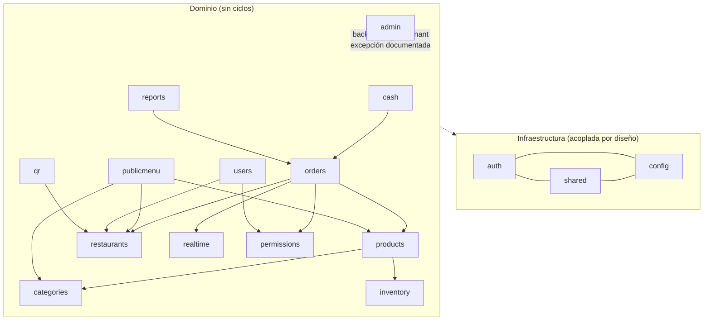

# Arquitectura

Monolito modular por dominio. Cada módulo `com.menusaas.<modulo>` expone su
funcionalidad vía **services**; ningún módulo toca el `repository` de otro
(regla `ModuleBoundariesTest`). Los controllers solo reciben, validan
(`@Valid`) y delegan.

## Diagrama de módulos (quién puede depender de quién)

Notas:

- `auth` usa `users.repository` y `restaurants.repository` (bootstrap de
  identidad: el registro crea tenant + usuario en una transacción).
- `admin` es el único módulo autorizado a leer todos los tenants
  (ver `admin/package-info.java`).
- El stock del producto se sirve bajo `/api/inventory` (`ProductStockController`
  en `products`: `GET /low-stock`, `POST /adjust`) porque el stock vive en el
  producto; las rutas son las de siempre.

## Login / refresh / logout

1. `POST /api/auth/register|login` → `AuthService` crea/valida el usuario,
   emite access (15 min) + refresh (24 h) y los deja en cookies HttpOnly
   (`access_token` path `/`, `refresh_token` path `/api/auth`).
2. `JwtAuthenticationFilter` lee `Authorization: Bearer` o la cookie,
   resuelve el `uid` y recarga el `UserPrincipal` desde BD en cada request.
3. `POST /api/auth/refresh` rota el refresh (hash SHA-256 en BD, tope absoluto
   de sesión de 24 h, detección de reúso) y reemite ambas cookies.
4. `POST /api/auth/logout[/-all]` revoca el refresh actual (o todos) y limpia
   cookies. `GET /api/auth/me` restaura la sesión; `GET /api/auth/csrf`
   inicializa el token CSRF del SPA.

## Tenant: identificación y aislamiento

- Base compartida + columna `restaurant_id`. El tenant sale **siempre** del
  servidor (`SecurityUtils.currentRestaurantId()` ← `UserPrincipal` fresco de
  BD); nunca de parámetros del cliente. Lo público sin auth resuelve por `slug`.
- Las entidades con tenant implementan `shared.tenancy.TenantOwned`.
  Sus repositorios solo declaran consultas con `restaurantId`
  (`TenantRepositoriesTest`); los heredados de `JpaRepository`
  (`findById`, `findAll`, …) solo los usa `admin`.
- Sin tenant propio (acceso vía service que valida pertenencia):
  `order_items` y `order_status_history` (vía `order_id`), `recipe_items`
  (vía producto/ingrediente), `stored_files` (IDs no adivinables + URL
  firmada), `audit_log` (solo backoffice). Migración recomendada (no creada):
  `V24__tenant_id_indirecto` con `restaurant_id` en esas tres tablas,
  rellenado por `JOIN` con su padre y `NOT NULL` tras el backfill.
- RLS de Postgres solo bloquea la API pública de Supabase; el backend es owner
  y el aislamiento lo hace el código (filtrado manual en cada consulta).

## Permisos

Roles: `SUPER_ADMIN`, `RESTAURANT_ADMIN`, `RESTAURANT_USER`, `WAITER`, `CASHIER`.
Permisos granulares (`permissions.Permissions`: `MENU_EDIT`, `ORDERS_EDIT`,
`ORDER_SERVE`, `ORDER_KITCHEN`, `ORDER_CANCEL`, `CASH_CHARGE`, `CASH_CLOSE`,
`INVENTORY_MANAGE`, `REPORTS_VIEW`, `USERS_MANAGE`, `SETTINGS_EDIT`).

`RESTAURANT_ADMIN` tiene todo; el resto usa defaults o la matriz por
restaurante (`role_permissions`, `PermissionService`). Se declaran en el
controller (`@PreAuthorize("@permissions.has('X')")` o `hasRole(...)`); los
services solo chequean reglas que dependen de datos
(ver `docs/CONVENTIONS.md`).

## Realtime (WebSocket)

`OrderService` → `orders.events.OrderEventPublisher` (evento Spring en la misma
transacción) → `realtime.WsOrderRelay` (`@TransactionalEventListener
AFTER_COMMIT`) → `SimpMessagingTemplate` al tópico
`/topic/r/{restaurantId}/orders`. El staff solo recibe el evento si el pedido
quedó confirmado en BD.
