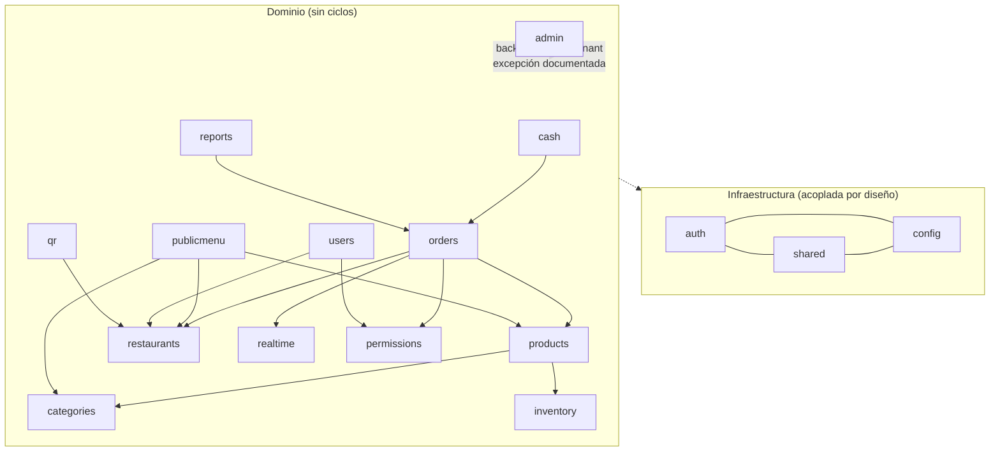

# Arquitectura

Monolito modular por dominio. Cada módulo `com.menusaas.<modulo>` expone su
funcionalidad vía **services**; ningún módulo toca el `repository` de otro
(regla `ModuleBoundariesTest`). Los controllers solo reciben, validan
(`@Valid`) y delegan.

## Diagrama de módulos (quién puede depender de quién)

```mermaid
flowchart TB
    subgraph infra["Infraestructura (acoplada por diseño)"]
        auth --- shared
        auth --- config
        shared --- config
    end
    subgraph dom["Dominio (sin ciclos)"]
        admin
        cash --> orders
        reports --> orders
        orders --> products
        orders --> restaurants
        orders --> realtime
        orders --> permissions
        products --> categories
        products --> inventory
        publicmenu --> categories
        publicmenu --> products
        publicmenu --> restaurants
        users --> restaurants
        users --> permissions
        qr --> restaurants
    end
    dom -.-> infra
    admin -.->|"backoffice cross-tenant\nexcepción documentada"| dom
```

Notas:

- `auth` usa `users.repository` y `restaurants.repository` (bootstrap de
  identidad: el registro crea tenant + usuario en una transacción).
- `admin` es el único módulo autorizado a leer todos los tenants
  (ver `admin/package-info.java`).
- El stock del producto se sirve bajo `/api/inventory` (`ProductStockController`
  en `products`: `GET /low-stock`, `POST /adjust`) porque el stock vive en el
  producto; las rutas son las de siempre.

## Login / refresh / logout

1. `POST /api/auth/register|login` → `AuthService` crea/valida el usuario,
   emite access (15 min) + refresh (24 h) y los deja en cookies HttpOnly
   (`access_token` path `/`, `refresh_token` path `/api/auth`).
2. `JwtAuthenticationFilter` lee `Authorization: Bearer` o la cookie,
   resuelve el `uid` y recarga el `UserPrincipal` desde BD en cada request.
3. `POST /api/auth/refresh` rota el refresh (hash SHA-256 en BD, tope absoluto
   de sesión de 24 h, detección de reúso) y reemite ambas cookies.
4. `POST /api/auth/logout[/-all]` revoca el refresh actual (o todos) y limpia
   cookies. `GET /api/auth/me` restaura la sesión; `GET /api/auth/csrf`
   inicializa el token CSRF del SPA.

## Tenant: identificación y aislamiento

- Base compartida + columna `restaurant_id`. El tenant sale **siempre** del
  servidor (`SecurityUtils.currentRestaurantId()` ← `UserPrincipal` fresco de
  BD); nunca de parámetros del cliente. Lo público sin auth resuelve por `slug`.
- Las entidades con tenant implementan `shared.tenancy.TenantOwned`.
  Sus repositorios solo declaran consultas con `restaurantId`
  (`TenantRepositoriesTest`); los heredados de `JpaRepository`
  (`findById`, `findAll`, …) solo los usa `admin`.
- Sin tenant propio (acceso vía service que valida pertenencia):
  `order_items` y `order_status_history` (vía `order_id`), `recipe_items`
  (vía producto/ingrediente), `stored_files` (IDs no adivinables + URL
  firmada), `audit_log` (solo backoffice). Migración recomendada (no creada):
  `V24__tenant_id_indirecto` con `restaurant_id` en esas tres tablas,
  rellenado por `JOIN` con su padre y `NOT NULL` tras el backfill.
- RLS de Postgres solo bloquea la API pública de Supabase; el backend es owner
  y el aislamiento lo hace el código (filtrado manual en cada consulta).

### El aislamiento tiene UNA capa, y conviene decirlo claro

En Postgres, **el dueño de una tabla está exento de RLS** salvo que la tabla
declare `FORCE ROW LEVEL SECURITY`. Este proyecto conecta como `menu_saas`, que
es el owner, y las políticas de `V7` están vacías a propósito (deny-all). En
concreto, hoy:

| Comprobación | Valor real |
|---|---|
| `pg_policies` | **0 políticas** |
| `relforcerowsecurity` | **false en todas las tablas** |
| RLS en tablas creadas tras `V7` | ausente en 9 (`cash_closings`, `ingredients`, `recipe_items`, `role_permissions`, `user_permissions`, `restaurant_tables`, `stock_movements`, `order_status_history`, `stored_files`) |

Además, `audit_log` **no tiene columna `restaurant_id`**: la bitácora se puede
consultar pero no se puede scopear por tenant ni en SQL ni por RLS. Hoy solo la
lee el backoffice, pero es una laguna de modelo a tener en cuenta antes de dar
por cerrado el aislamiento.

Es decir: **la RLS no protege a este backend de nada.** Sirve para que el API
público de Supabase no lea las tablas, y nada más. El aislamiento real lo hace
que cada consulta lleve el tenant, y lo sostienen:

- `TenantRepositoriesTest` (por reflexión: todo método de repositorio de entidad
  `TenantOwned` menciona el tenant en el nombre) y `ModuleBoundariesTest`.
- Un test de ArchUnit que prohíbe `findById`/`deleteById` fuera de `admin`.
- `TenantIsolationIT` y las pruebas de `OrdersIT.orderListing_neverLeaksAcrossTenants`
  y `orderHistory_neverLeaksAcrossTenants`, que crean dos tenants reales y
  comprueban que el listado (que va por `Specification`, patrón que las pruebas
  por reflexión **no** cubren) y el historial no se cruzan.

**El patrón que falta cubrir**: un `repository.findAll(spec)` se salta la regla
de nombres, porque el tenant viaja dentro de la `Specification`. Si alguien
construye ese spec sin el predicado de `restaurant_id`, devuelve datos de todos
los tenants y ninguna prueba estática lo detecta. Hoy solo hay un `findAll(spec)`
en el proyecto (`OrderService.listMine`) y sí lo lleva.

### Qué exigiría cerrar esto en la base de datos

`FORCE ROW LEVEL SECURITY` + políticas sobre una variable de sesión
(`SET LOCAL app.tenant_id`), más un filtro que la fije por petición. **No está
hecho, a propósito, porque tiene un coste que hay que decidir antes:**

1. **Contexto de sistema.** Login, menú público, tracking, webhook de ePayco,
   jobs programados y todo `SUPER_ADMIN` consultan sin tenant (no existe, o es
   null a propósito). Hoy son ~20 métodos de repositorio. Cada uno necesitaría
   una marca explícita de "contexto de sistema"; un olvido rompe producción.
2. **Fallo abierto o cerrado.** Sin variable, una política estricta no devuelve
   nada (fail-closed: un olvido se ve, no filtra) o devuelve todo
   (fail-open: conserva el problema actual). Fail-closed es lo correcto, pero
   convierte cualquier olvido en una caída.
3. **El pool de conexiones.** `app.tenant_id` es de *sesión*: con HikariCP, si
   la petición siguiente reutiliza esa conexión sin fijarla, vería los datos del
   tenant anterior. Obliga a fijar y **limpiar** siempre, incluso en error.

Es decir: worthwhile, pero no es un cambio que deba aplicarse sin decidir (1) y
aceptar (2) y (3). Hasta entonces, la segunda capa la dan los tests de
aislamiento, y por eso estos cubren comportamiento y no solo firmas de métodos.

## Permisos

Roles: `SUPER_ADMIN`, `RESTAURANT_ADMIN`, `RESTAURANT_USER`, `WAITER`, `CASHIER`.
Permisos granulares (`permissions.Permissions`: `MENU_EDIT`, `ORDERS_EDIT`,
`ORDER_SERVE`, `ORDER_KITCHEN`, `ORDER_CANCEL`, `CASH_CHARGE`, `CASH_CLOSE`,
`INVENTORY_MANAGE`, `REPORTS_VIEW`, `USERS_MANAGE`, `SETTINGS_EDIT`).

`RESTAURANT_ADMIN` tiene todo; el resto usa defaults o la matriz por
restaurante (`role_permissions`, `PermissionService`). Se declaran en el
controller (`@PreAuthorize("@permissions.has('X')")` o `hasRole(...)`); los
services solo chequean reglas que dependen de datos
(ver `docs/CONVENTIONS.md`).

## Realtime (WebSocket)

`OrderService` → `orders.events.OrderEventPublisher` (evento Spring en la misma
transacción) → `realtime.WsOrderRelay` (`@TransactionalEventListener
AFTER_COMMIT`) → `SimpMessagingTemplate` al tópico
`/topic/r/{restaurantId}/orders`. El staff solo recibe el evento si el pedido
quedó confirmado en BD.
